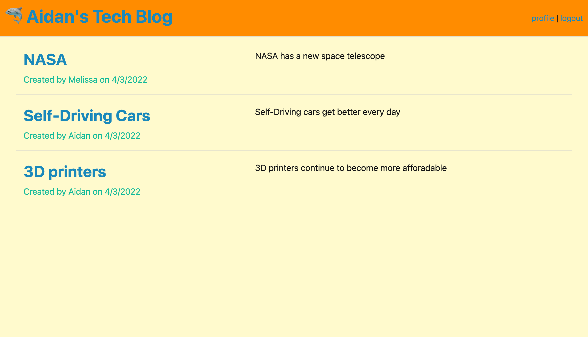

# technology-blog 

## Table of Contents:

-   [Description](./README.md#description)
-   [Installation](./README.md#installation)
-   [Usage](./README.md#usage)
-   [License](./README.md#license)
-   [Contributing](./README.md#contributing)
-   [Screenshot](./README.md#screenshot)
-   [Links to Application](./README.md#links-to-application)
-   [Questions](./README.md#questions)

## Description

This is a blog site application. When a user visits the site for the first time, they are presented with the homepage which displays existing blog posts and presents a navigation link to the login/signup page. From any page on the site, a user can click on the Site Name in the upper left of the window to be brought back to the homepage. When a user clicks on one of the existing posts, they are taken to the post's page, which displays the post's information and associated comments. A user must be logged in to contribute a new comment to a post. When a user clicks "login" in the navigation bar, they are brought to the login page. On the login page, a user may login with their credentials if they are an existing user in the database, otherwise they can submit new credentials to be added into the database as a new user. When the user submits their login/signup, they are brought to the user profile page. When the user is signed in, the navigation bar at the top includes links to the profile page and logout functionality. On the profile page, a user is presented a form for creating a new post, along with a list of posts that have been created by the user and buttons to edit or delete each post. Clicking on a post in this list with take the user to the post's page, where comments may be added. Clicking the edit button next to a user's post with take the user to the post update page, where a form is auto-filled with the post's existing information. The user may then change the information as desired and submit the form to commit the changes to the database. Clicking the delete button next to a user's post will delete the post from the database. 

## Installation

If you wish to use this application, you will need to access my GitHub account (RedComet6) and copy/fork the code.

## Usage

To use this application, obtain the code from my GitHub account (RedComet6), and run "node server.js" or "npm run start" from the command line terminal.

## License

This software is licensed to MIT, for more information you may visit this link:
[MIT License Wikipedia](https://en.wikipedia.org/wiki/MIT_License)

## Contributing

If you wish to contribute to my content, please contact me at asunshine99@gmail.com.

## Screenshot

## Links to Application

-   Here is the heroku: [https://redcomet6.github.io/back-end-Ecommerce/](https://redcomet6.github.io/back-end-Ecommerce/)
-   Here is the repo: [https://github.com/RedComet6/technology-blog](https://github.com/RedComet6/technology-blog)

## Questions

If you have any questions, you may contact:

#### Aidan Chamberlain

Email: asunshine99@gmail.com  
Github Profile: [https://www.github.com/RedComet6](https://www.github.com/RedComet6)